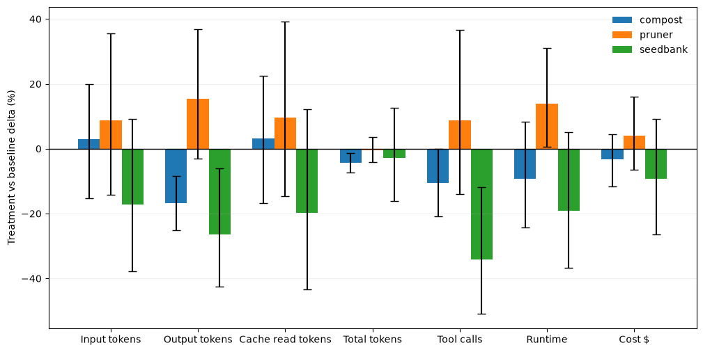

# 🌱 Context Garden

Self-contained Agent Skills that cut an agent's context usage —
deterministic, offline, no LLM calls inside the tooling itself. This management tool is most useful for extended coding sessions with a lot of context and bigger repositories. For small repositories or toy examples savings might not be worth the overhead.

| Skill | Does |
|---|---|
| 🌰 [`seedbank`](skills/seedbank) | Promotes repeatedly-rediscovered repo facts into a small, always-loaded `AGENTS.md`. |
| ✂️ [`pruner`](skills/pruner) | Returns exact `file:start-end` ranges worth reading (Python + C/C++) instead of grep-exploring. |
| ♻️ [`compost`](skills/compost) | Compacts huge compiler/test/CI/HPC output into clustered summaries. |
| 🌿 [`trellis`](skills/trellis) | Correctness gate for numerical code (convergence order, residuals, conditioning). |
| 🌾 [`weeder`](skills/weeder) | Shrinks a Skill's always-loaded token cost without losing instructions. |

Here you can see some benchmarking results for the rather small benchmarks included in this repo, evaluated on claude-code.



## How to use
Replace `{skill}` with the skills name to install the skill for your agent.
```bash
cp -r skills/{skill} ~/.claude/skills/{skill}   # or project's .claude/skills/
```

To run tests of a skill run:
```bash
skills/compost/bin/{skill} --help
bash skills/{skill}/tests/smoke_test.sh   # offline, bundled fixtures
```

## Repository
The repository is structured as follows:
```text
skills/      the Skills
tests/       repo-level tests
benchmarks/  evaluation harness + fixtures
docs/        architecture, skill development, benchmarking
```
For more details check the documentation in: [`docs/architecture.md`](docs/architecture.md),
[`docs/skill-development.md`](docs/skill-development.md),
[`docs/benchmarking.md`](docs/benchmarking.md).

## Contributing

See [`CONTRIBUTING.md`](CONTRIBUTING.md).

## License

See [`LICENSE`](LICENSE).
