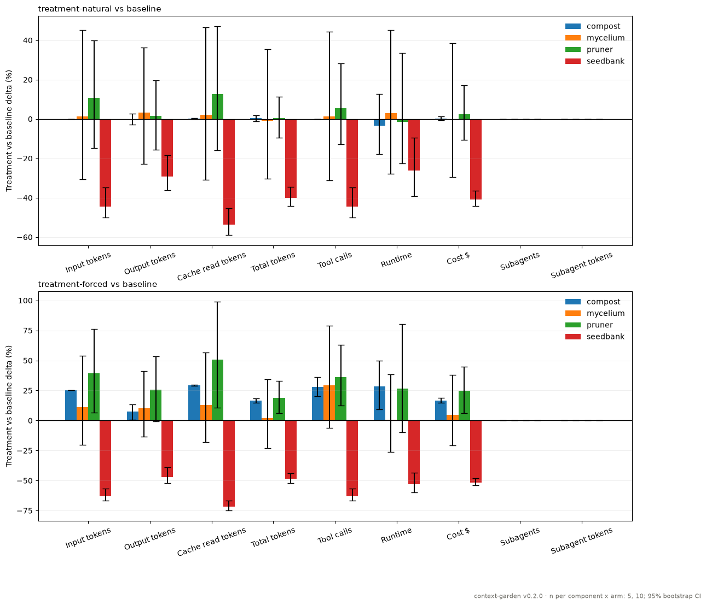

# 🌱 Context Garden

Self-contained Agent Skills that cut an agent's context usage — deterministic, offline, no LLM calls inside the tooling.

| Skill | Does |
|---|---|
| 🌰 [`seedbank`](skills/seedbank) | Promotes repeatedly-rediscovered repo facts into a small, always-loaded `AGENTS.md`. |
| ✂️ [`pruner`](skills/pruner) | Returns exact `file:start-end` ranges worth reading (Python + C/C++) instead of grep-exploring. |
| ♻️ [`compost`](skills/compost) | Compacts huge compiler/test/CI/HPC output into clustered summaries. |
| 🍄 [`mycelium`](skills/mycelium) | Delegation gate for subagents (bounded brief, no duplicate investigations) plus shared finding notes so agents don't rediscover the same code. |
| 🌾 [`weeder`](skills/weeder) | Shrinks a Skill's always-loaded token cost without losing instructions. |

<!-- benchmark-figure:begin -->
Benchmark results for **v0.2.0** on the small fixtures in this repo, run with Claude Code ([summary](docs/benchmarks/v0.2.0/summary.md); older versions in [`docs/benchmarks/`](docs/benchmarks)):


<!-- benchmark-figure:end -->

## Install

As a plugin (all five skills, plus the seedbank and mycelium hooks):
```text
/plugin marketplace add oliverweissl/context-garden
/plugin install context-garden@context-garden
```
Or copy single skills (the hooks then need the settings snippet in the skill's `references/`):
```bash
cp -r skills/{skill} ~/.claude/skills/{skill}   # or the project's .claude/skills/
```

## Turn skills on, manual or off

Each skill has one of three modes. **All skills start `off`**: nothing runs, not even the
hooks, until you turn a skill on.

| Mode | Claude uses it on its own | You can call it | Its hooks run |
|---|---|---|---|
| `on` | yes, when relevant | yes | yes |
| `manual` | no | yes, with an instruction | no |
| `off` | no | no | no |

Set or show a mode (or ask Claude to, e.g. "turn compost on"):
```bash
skills/compost/bin/compost mode on         # this repo, only you: .claude/settings.local.json
skills/compost/bin/compost mode manual --scope user  # every repo (or --scope project to share)
skills/compost/bin/compost mode            # show the mode and where it comes from
```
With the plugin, `bin/` sits in the plugin's install directory, so either ask Claude or edit the
setting directly. The mode is stored as Claude Code's own `skillOverrides` setting, in
`.claude/settings.local.json` (this repo, only you), `.claude/settings.json` (shared) or
`~/.claude/settings.json` (all repos), most specific first:
```json
{"skillOverrides": {"compost": "on", "pruner": "user-invocable-only"}}
```
`"on"`, `"user-invocable-only"` (= `manual`) and `"off"` are the values; a skill with no entry is
`off`. For copied skills the `/skills` menu edits the same entries (Space cycles; "user-only" is
`manual`), but Claude Code itself treats a missing entry as on, so the skill's own check does the
switching off there too.
`CONTEXT_GARDEN_MODE_<SKILL>=on|manual|off` overrides everything for one shell.

Call a skill directly with an instruction after its name; this works in `on` and `manual`
(an `off` skill declines and tells you how to turn it on):
```text
/compost summarize the failing pytest run                 # copied skill
/context-garden:compost summarize the failing pytest run  # plugin
```

With the plugin, Claude Code ignores `skillOverrides` for plugin skills, so each skill checks
its mode itself when it loads: in `manual` it proceeds only if you asked for it, in `off` it
stops. Its one-line description is still listed to Claude (about 60-100 tokens per skill). To
drop that too, copy the skill instead of using the plugin, or disable the whole plugin with
`/plugin disable context-garden`.

## CLI help and smoke tests

```bash
skills/{skill}/bin/{skill} --help
bash skills/{skill}/tests/smoke_test.sh   # offline, bundled fixtures
```

## Docs

[`docs/architecture.md`](docs/architecture.md) (layout, self-containment rule, design principles) ·
[`docs/skill-development.md`](docs/skill-development.md) (adding a Skill) ·
[`docs/benchmarking.md`](docs/benchmarking.md) (running and plotting benchmarks) ·
[`examples/`](examples) (measured before/after).
Contributing: [`CONTRIBUTING.md`](CONTRIBUTING.md). License: [`LICENSE`](LICENSE).
